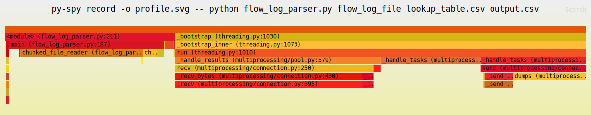

# Flow Log Parser Documentation

## Overview

The Flow Log Parser is a high-performance program designed to analyze flow log data by mapping each log entry to a specific tag based on a provided lookup table. This tool facilitates the categorization and summarization of network traffic, enabling users to gain insights into their network activities.

## Features

- **Flow Log Parsing:** Efficiently processes large flow log files to extract relevant fields.
- **Tag Mapping:** Utilizes a lookup table to assign tags based on destination port and protocol combinations.
- **Case-Insensitive Matching:** Ensures that tag assignments are not affected by case discrepancies.
- **Parallel Processing:** Leverages multi-core processing to handle large datasets efficiently.
- **Output Generation:** Produces a comprehensive report detailing tag counts and port/protocol combination counts.

## Implementation Details

### High-Performance Design

1. **Parallel Processing:**
   - The parser uses Python's `multiprocessing` module to distribute the workload across multiple CPU cores. This significantly speeds up the processing of large flow log files by dividing the file into chunks and processing each chunk in parallel.

2. **Chunked File Reading:**
   - The `chunked_file_reader` function reads the flow log file in chunks, allowing the program to handle large files without consuming excessive memory. Each chunk is processed independently, and results are aggregated at the end.

3. **Efficient Data Structures:**
   - The use of `defaultdict` from the `collections` module allows for efficient counting of tags and port/protocol combinations without the need for explicit initialization.

4. **Protocol Mapping:**
   - Numerical protocol identifiers are mapped to their corresponding protocol names using a predefined dictionary (`PROTOCOL_MAP`). This mapping is done efficiently to ensure quick lookups.

### Input Files

#### 1. Flow Log File

A plain text (ASCII) file containing flow log data. Each line represents a single flow log entry with multiple fields separated by spaces.

**Sample Flow Logs (Version 2):**
```
2 123456789012 eni-0a1b2c3d 10.0.1.201 198.51.100.2 443 49153 6 25 20000 1620140761 1620140821 ACCEPT OK
2 123456789012 eni-4d3c2b1a 192.168.1.100 203.0.113.101 23 49154 6 15 12000 1620140761 1620140821 REJECT OK
...
```

#### 2. Lookup Table File

A CSV file defining the mapping between destination ports, protocols, and their corresponding tags.

**Sample Lookup Table:**
```
dstport,protocol,tag
25,tcp,sv_P1
68,udp,sv_P2
23,tcp,sv_P1
31,udp,SV_P3
443,tcp,sv_P2
22,tcp,sv_P4
3389,tcp,sv_P5
0,icmp,sv_P5
110,tcp,email
993,tcp,email
143,tcp,email
```

### Output File

The program generates an output file containing:

1. **Tag Counts:** The number of matches for each tag.
   ```
   Tag Counts:
   Tag,Count
   sv_P2,1
   sv_P1,2
   sv_P4,1
   email,3
   Untagged,9
   ```

2. **Port/Protocol Combination Counts:** The number of matches for each port and protocol combination.
   ```
   Port/Protocol Combination Counts:
   Port,Protocol,Count
   22,tcp,1
   23,tcp,1
   25,tcp,1
   110,tcp,1
   143,tcp,1
   443,tcp,1
   993,tcp,1
   1024,tcp,1
   49158,tcp,1
   80,tcp,1
   ```

## Generating Test Data

To generate the necessary test data files, use the `generate_test_files.py` script. This script will create a lookup table and a flow log file with specified parameters.

### Steps to Generate Test Data

1. **Run the Script:**

   Execute the following command in your terminal:

   ```bash
   python generate_test_files.py
   ```

2. **Parameters:**

   - **Lookup Table File Path:** The script generates a lookup table CSV file at the specified path.
   - **Flow Log File Path:** The script generates a flow log file at the specified path.
   - **Number of Mappings:** Adjust the number of mappings in the lookup table (default is 10,000).
   - **Number of Entries:** Adjust the number of entries in the flow log file (default is 1,000,000).
   - **Include Malformed Lines:** Set to `True` to include malformed lines in the flow log for testing parser robustness.

3. **Output:**

   - The script will output the generated files to the specified paths and print confirmation messages upon successful generation.

## Requirements

- **Input Files:**
  - Both the flow log file and the lookup table must be plain text (ASCII) files.
  
- **File Sizes:**
  - Flow log file: Up to 10 MB.
  - Lookup table file: Up to 10,000 mappings.

- **Tag Mapping:**
  - Tags can correspond to multiple port and protocol combinations. For example, `sv_P1` and `sv_P2` are mapped to different combinations in the sample lookup table.

- **Case Insensitivity:**
  - Matching of ports and protocols should be case-insensitive to ensure consistency in tag assignments.

## Assumptions

- **Flow Log Structure:** Each flow log entry contains at least 14 fields separated by spaces. Entries with fewer fields are considered malformed and are skipped.
  
- **Protocol Mapping:** Numerical protocol identifiers are mapped to their corresponding protocol names (e.g., `6` to `tcp`, `17` to `udp`, `1` to `icmp`). Unknown protocol numbers are labeled as `unknown`.

- **Unique Identifiers:** Each tag in the lookup table is assumed to be unique per port and protocol combination.

- **Output Format:** The output file is structured in CSV format for easy readability and further processing.

## Usage

```bash
python flow_log_parser.py <flow_log_file> <lookup_csv_file> <output_file>
```

- `<flow_log_file>`: Path to the flow log data file.
- `<lookup_csv_file>`: Path to the lookup table CSV file.
- `<output_file>`: Desired path for the output report.

## Example

```bash
python flow_log_parser.py flow_logs.txt lookup_table.csv output_report.csv
```

## Test Results
During testing, the Flow Log Parser efficiently processed a flow log file containing **1,000,000 log entries**, generating an output CSV file in **just 1.66 seconds**.

```
Processing complete. Output written to 'output.csv'. Time taken: 1.66 seconds.
```

### Profile the Program

```bash
pip install py-spy
sudo py-spy record -o profile.svg -- python flow_log_parser.py flow_log_file lookup_table.csv output.csv
```



#### TODO Performance Optimizations

## Error Handling

- **Malformed Lines:** Lines in the flow log file with fewer than 14 fields are skipped, and a warning is logged.
- **Missing Files:** The program exits gracefully with an error message if the specified input files are not found or cannot be opened.
- **Invalid Protocols:** Protocol numbers not defined in the `PROTOCOL_MAP` are categorized under the `unknown` protocol.

## Dependencies

- **Python 3.x**
- **CSV Module:** For reading and writing CSV files.
- **Collections Module:** Specifically, `defaultdict` for counting occurrences.
- **Multiprocessing Module:** For parallel processing of flow log data.

### License

This project is licensed under the MIT License - see the [LICENSE](LICENSE) file for details.